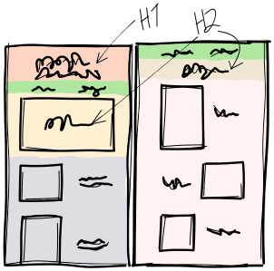

# Film Photo Showcase 3.0

Fetch photos from the Flickr API.

## Used technologies

- React 18
- TypeScript
- [Astro](https://astro.build/)
- [Tailwind CSS](https://tailwindcss.com/)

## To-do

- Style menu buttons
- Camera page
- Share image
- Font sizes

## Requirements

Requires Node 20.

## Preparations

Create a Flickr App and use the app key to fetch images from the Flickr API. Methods are listed [in the App Garden](https://www.flickr.com/services/api/).

## Fonts

- Headings: [Calligrapher.ai](https://www.calligrapher.ai/)

- Body: Montserrat ([Fontsource](https://fontsource.org/fonts/montserrat))
